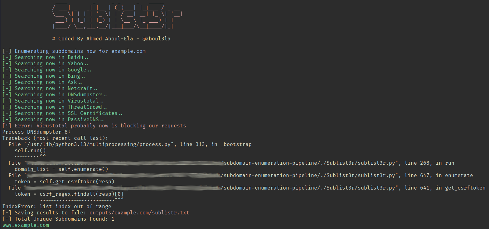
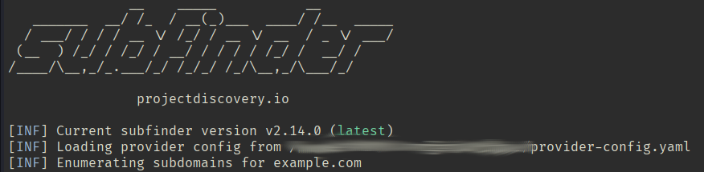
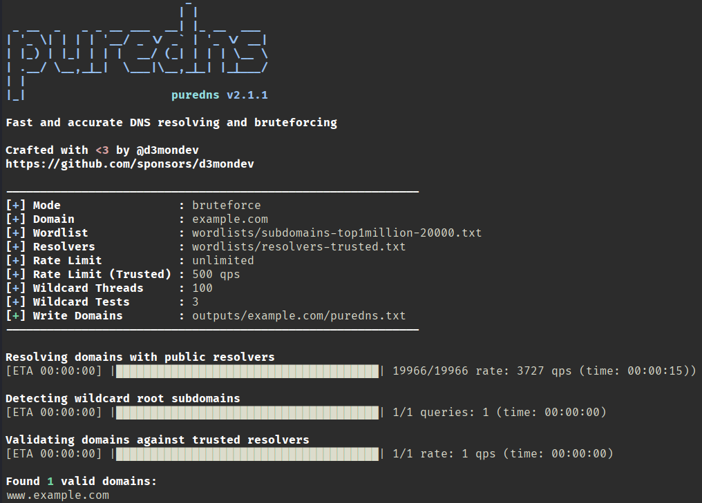
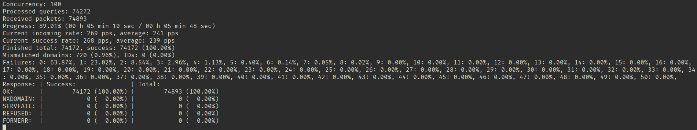
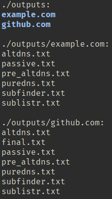

# Execution Examples

This page contains sample outputs from each stage of the pipeline. These screenshots demonstrate the expected behavior during a successful execution.

---

## Passive Enumeration — Sublist3r

Sublist3r gathers publicly available subdomains from multiple online data sources.



---

## Passive Enumeration — Subfinder

Subfinder discovers subdomains from a variety of passive sources and APIs.



---

## Active Enumeration — PureDNS

PureDNS performs DNS bruteforcing using the provided wordlist and validates discovered subdomains using trusted DNS resolvers.



---

## Alternate Hostname Validation — MassDNS

MassDNS validates the hostnames generated by AltDNS, ensuring that only resolvable subdomains are retained.



---

## Generated Output Directory

Each execution creates a dedicated directory for the target domain, preserving the output of every stage for inspection and future analysis.



---

## Typical Directory Structure

```text
outputs/
└── example.com/
    ├── altdns.txt
    ├── passive.txt
    ├── pre_altdns.txt
    ├── puredns.txt
    ├── subfinder.txt
    ├── sublistr.txt
    └── final.txt
```

The pipeline intentionally preserves intermediate results (except large temporary files removed during cleanup) to simplify troubleshooting and allow each stage to be inspected independently.